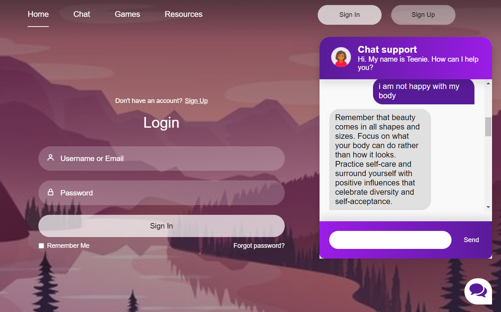

# MindPal: Teen Mental Wellness Platform

MindPal is a comprehensive mental wellness platform designed specifically for teenagers. It offers a range of features aimed at supporting teens in managing their mental health and well-being effectively.

## Features

### Chatbot Support

MindPal's chatbot provides a safe space for teenagers to ask mental health-related questions and receive supportive responses.

### Soothing Music

Access a curated collection of relaxing music tracks to help users de-stress and unwind.

### Games

Engage in fun and interactive games designed to promote relaxation and mental stimulation.

### Resource Hub

Explore a variety of mental health resources, including helpline numbers, reading materials, and publications.

## How It Works

MindPal provides a user-friendly interface where teens can navigate different sections of the platform seamlessly. Whether seeking advice from the chatbot, enjoying calming music, playing games, or accessing mental health resources, users can easily find what they need to support their well-being.

## Technologies Used

- **Flask**: Backend web framework for building the server-side components.
- **HTML/CSS/JavaScript**: Frontend development technologies for creating the user interface and interactive elements.
- **PyTorch**: Used for implementing machine learning components, such as the chatbot.
- **Numpy**: Fundamental package for scientific computing, utilized in various parts of the project.
- **Gunicorn**: Python WSGI HTTP server for deployment.

## Installation and Setup

1. Clone the repository: `git clone https://github.com/Nandini-Pandey/npm-MindPal.git`
2. Install dependencies: `pip install -r requirements.txt`
3. Run the Flask app: `python app.py`
4. Access the application via the provided URL in your web browser.

